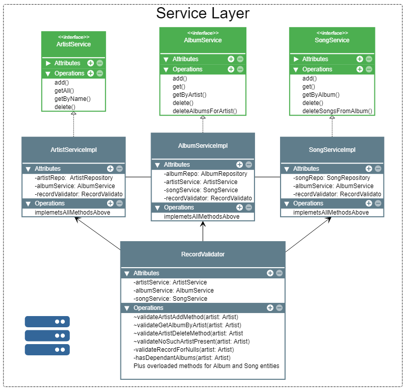
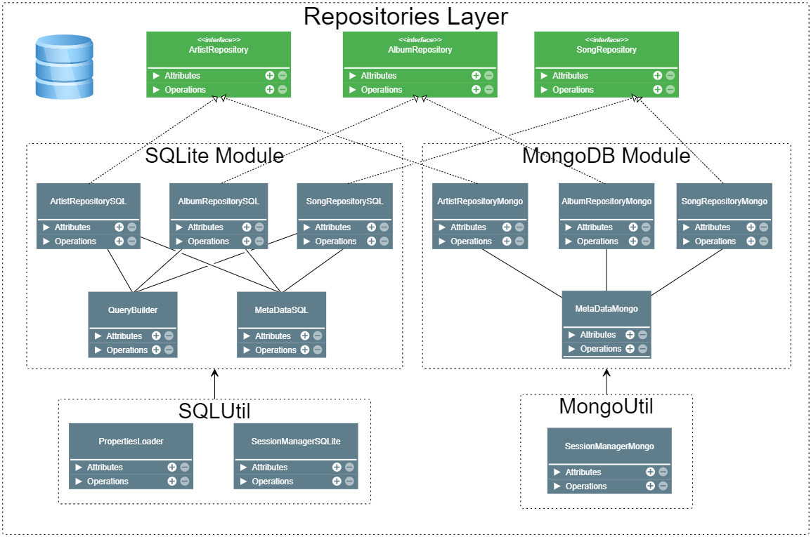

# Music Repository Back-end Application

This application is designed as a back-end application to allow users to perform CRUD operations on music records. It is possible to operate on Artists, Albums and Songs.

## Main features:
- Architecture is built on Inversion of Control principles by implementing Service Pattern
- Supports multiple databases integration for scalability and portability purposes 
(MongoDB and SQLite3 modules available)
- Custom Exceptions module supports the program workflow
- All Service implementations are covered with integration tests (JUnit and Mockito)
- Maven for managing dependencies
- Docker Image with the application inside available at DockerHub 

*[Take me to DockerHub!](https://hub.docker.com/)*
	

## High-Level Architecture

   

   <i>"High level overview of the architecture"</i>

## Modules Overview

This section will guide you module by module following the application flow. Fasten your seat belts :)

### Entities

**Purpose:** Facilitates all layers of the application - serves as a coherent form of efficient data transmission from user to DB and visa versa.

**Features:**

- Each class follows composition design
- This enforces cross-class relations between three of them
- Lazy initialization of entities when retrieved from DB

   

### Service Layer

**Purpose:** Receives requests from User, validates, applies business logic and passes the request to Repositories Level.

**Features:**

- Each Service requires an instance of the corresponding Repository and neighbouring Service (i.e. SongService requires an instance of AlbumService)
- Lazy Initialization is used for fetching data from DB
- Validation logic is outsourced to RecordValidation class that does various checks utilizing all three Services
- Performs Cascade deletion of data (i.e. If Artist is deleted -> validates if DB has Albums for this Artist -> if Yes deletes Albums and Songs)
- Service level methods require and operate on entities described above, not primitives

   

### Repository Layer

**Purpose:** Serves as a tool for the Service layer to write/read/delete to DBs.

**Features:**

- Each DB module has a Util class that helps them to establish and manage a pool of connections
- Connections to databases are configured with .properties files
- Repositories for each DB implement interfaces, to ensure each new module added would have identical structure and functionality
- Using Prepared statements to prevent SQL injections
- QueryBuilder implements Builder pattern and supports SQL query creation for SQLiteRepository
- MetaDataSQLite and MetaDataMongo contain all the final strings with table and column names

   

